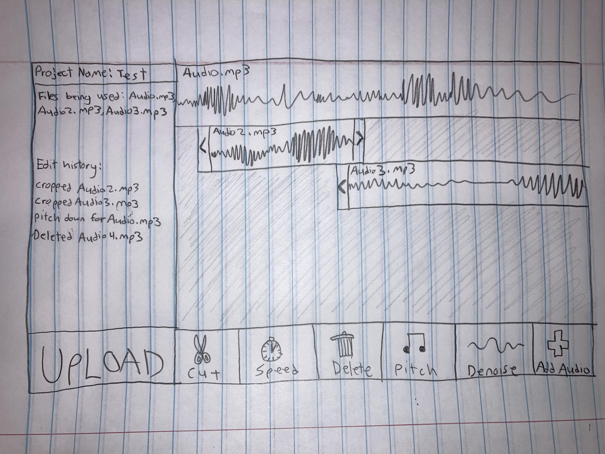

# Your startup name here
I think I was told to modify this so here it is.
And this is an edit made from the website itself.

[My Notes](notes.md)

A brief description of the application here.

> [!NOTE]
>  This is a template for your startup application. You must modify this `README.md` file for each phase of your development. You only need to fill in the section for each deliverable when that deliverable is submitted in Canvas. Without completing the section for a deliverable, the TA will not know what to look for when grading your submission. Feel free to add additional information to each deliverable description, but make sure you at least have the list of rubric items and a description of what you did for each item.

> [!NOTE]
>  If you are not familiar with Markdown then you should review the [documentation](https://docs.github.com/en/get-started/writing-on-github/getting-started-with-writing-and-formatting-on-github/basic-writing-and-formatting-syntax) before continuing.

## 🚀 Specification Deliverable

> [!NOTE]
>  Fill in this sections as the submission artifact for this deliverable. You can refer to this [example](https://github.com/webprogramming260/startup-example/blob/main/README.md) for inspiration.

For this deliverable I did the following. I checked the box `[x]` and added a description for things I completed.

- [ ] Proper use of Markdown
- [ ] A concise and compelling elevator pitch
- [ ] Description of key features
- [ ] Description of how you will use each technology
- [ ] One or more rough sketches of your application. Images must be embedded in this file using Markdown image references.

### Elevator pitch

Have you ever tried editing audio files? There are plenty of free applications available, but most of them limit your options behind a pay wall. But what if you want to edit an audio file without having to pay a ridiculous amount of money? Well, you came to the right place. This application gives you tools to edit audio files, letting you merge audio, change tempo, pitch, and more!

### Design

This is what the application will look like.

### Key features

- Upload audio files
- Modify audio files
> _trim,_
> _change speed,_
> _layer,_
> _denoise, etc_
- Store new audio files

### Technologies

I am going to use the required technologies in the following ways.

- **HTML** - At least two HTML pages, one for login and the other for the audio editor itself.
- **CSS** - Make it look pretty and easy to look at/navigate.
- **React** - Button to play/stop the audio, duplicate audio, sliders to trim, speed it up/slow it down, add more audio files, etc.
- **Service** - Stuff for login, modifying the audio soundwave itself, saving the modified audio into a new file, AI noise cleaning and other effects.
- **DB/Login** - Stores users and the new audio files they have created. Credentials securely stored. Can't find previously created audio files unless logged in.
- **WebSocket** - Add short audio clips from online, share audio with other users.

## 🚀 AWS deliverable

For this deliverable I did the following. I checked the box `[x]` and added a description for things I completed.

- [x] **Server deployed and accessible with custom domain name** - [My server link](https://mora11do.click).

## 🚀 HTML deliverable

For this deliverable I did the following. I checked the box `[x]` and added a description for things I completed.

- [x] **HTML pages** - I have three separate pages. I have index.html, login.html, and savedmusic.html
- [x] **Proper HTML element usage** - I'll be honest I mostly just copied the fomatting from simon but I do have BODY, NAV, MAIN, HEADER, and FOOTER
- [x] **Links** - There are links to each of the html pages.
- [x] **Text** - There is basic text explaining what certain things will do when working.
- [x] **3rd party API placeholder** - AI denoiser made by someone else and ability to search for and watch Youtube videos.
- [x] **Images** - Added a sample image of what the editor might look like (as well as two other images).
- [x] **Login placeholder** - Basic welcome message and an html page dedicated to the login.
- [x] **DB data placeholder** - Previously saved audio files created by users are saved in the database. Audio files made by others are also saved.
- [x] **WebSocket placeholder** - Live sharing of music, as well as a basic chat system between users.

## 🚀 CSS deliverable

For this deliverable I did the following. I checked the box `[x]` and added a description for things I completed.

- [x] **Header, footer, and main content body** - Looking pretty spicy. Added color and stuff.
- [x] **Navigation elements** - Made the buttons change color when you hover over them and they are side by side and look nicer.
- [x] **Responsive to window resizing** - Footer stays on the bottom, Text moves around and attempts to fit on screen.
- [x] **Application elements** - Made various things look nicer, like the log in part.
- [x] **Application text content** - Changed the font. Also centered text.
- [x] **Application images** - Made corners rounded and also added a small border.

## 🚀 React part 1: Routing deliverable

For this deliverable I did the following. I checked the box `[x]` and added a description for things I completed.

- [ ] **Bundled using Vite** - I did not complete this part of the deliverable.
- [ ] **Components** - I did not complete this part of the deliverable.
- [ ] **Router** - I did not complete this part of the deliverable.

## 🚀 React part 2: Reactivity deliverable

For this deliverable I did the following. I checked the box `[x]` and added a description for things I completed.

- [ ] **All functionality implemented or mocked out** - I did not complete this part of the deliverable.
- [ ] **Hooks** - I did not complete this part of the deliverable.

## 🚀 Service deliverable

For this deliverable I did the following. I checked the box `[x]` and added a description for things I completed.

- [ ] **Node.js/Express HTTP service** - I did not complete this part of the deliverable.
- [ ] **Static middleware for frontend** - I did not complete this part of the deliverable.
- [ ] **Calls to third party endpoints** - I did not complete this part of the deliverable.
- [ ] **Backend service endpoints** - I did not complete this part of the deliverable.
- [ ] **Frontend calls service endpoints** - I did not complete this part of the deliverable.
- [ ] **Supports registration, login, logout, and restricted endpoint** - I did not complete this part of the deliverable.

## 🚀 DB deliverable

For this deliverable I did the following. I checked the box `[x]` and added a description for things I completed.

- [ ] **Stores data in MongoDB** - I did not complete this part of the deliverable.
- [ ] **Stores credentials in MongoDB** - I did not complete this part of the deliverable.

## 🚀 WebSocket deliverable

For this deliverable I did the following. I checked the box `[x]` and added a description for things I completed.

- [ ] **Backend listens for WebSocket connection** - I did not complete this part of the deliverable.
- [ ] **Frontend makes WebSocket connection** - I did not complete this part of the deliverable.
- [ ] **Data sent over WebSocket connection** - I did not complete this part of the deliverable.
- [ ] **WebSocket data displayed** - I did not complete this part of the deliverable.
- [ ] **Application is fully functional** - I did not complete this part of the deliverable.
